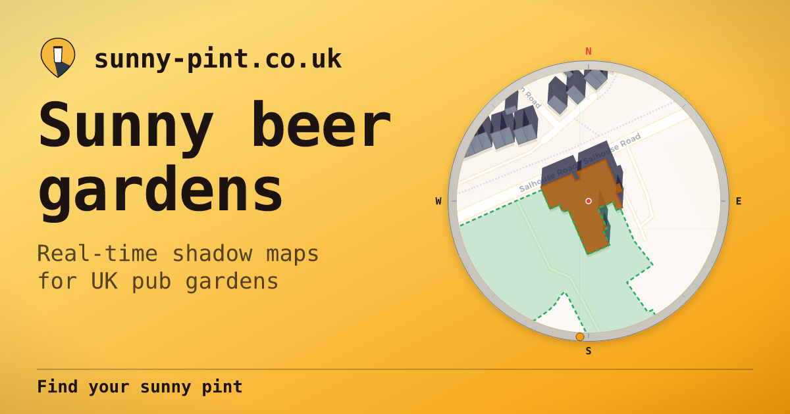

# Sunny Pint &#127866;

**Find sunny beer garden seats** — real-time shadow maps showing which pub gardens have sun right now.



**[sunny-pint.co.uk](https://sunny-pint.co.uk)**

## What is this?

Sunny Pint uses LiDAR elevation data and building footprints to project geometric shadows in real-time. Point it at any UK pub and see exactly where the sun hits — now, or at any time of day.

### Features

- **Porthole view** — circular shadow map with basemap tiles, building polygons, and geometric shadow projection
- **Sun arc** — drag to scrub time, play to animate sunrise-to-sunset at 60fps
- **38k UK pubs** — extracted from OpenStreetMap, each with a precomputed Sunny Rating
- **Building heights** — sampled from Environment Agency 1m LiDAR DSM/DTM
- **Weather** — live cloud cover from Open-Meteo (no API key needed)
- **Pub signs** — procedurally generated heraldic devices, unique per pub
- **Share** — snapshot image with porthole, pub name, weather, and deep link
- **SEO landing pages** — per-city and per-pub pages with structured data
- **Dark/light theme** — system-aware with manual toggle
- **PWA** — installable, offline cached, works on mobile
- **Deep linking** — URLs encode location, pub, time, and date

## Quick Start

This project runs in a devcontainer. Open in VS Code with the Dev Containers extension.

```bash
pnpm install          # Install frontend dependencies
just dev              # Start Vite dev server (port 5173)
just release          # Production build + SEO landing pages → dist/
```

## Data Pipeline

The app serves pre-computed static data. The pipeline processes raw sources into `public/data/`:

```bash
just pipeline                  # Run for Norwich (default)
just pipeline area=bristol     # Run for another city
just pipeline area=uk          # Full UK (slow)
```

### Pipeline steps

> **Note**: the table below describes the v1 per-script pipeline. Production
> now uses the v2 consolidated pipeline in `pipeline/stages/*.py`
> (EXTRACT → INDEX → ENRICH → PACKAGE → SCORE), orchestrated by
> `pipeline/run.py`. The v1 scripts under `scripts/` are kept for
> reference but aren't used by `just pipeline`.

| Step | Script | Input | Output |
|------|--------|-------|--------|
| 1. Merge pubs | `scripts/merge_pubs.py` | OSM .pbf | `data/pubs_merged.json` |
| 2. Download INSPIRE | `scripts/download_inspire.py` | HM Land Registry | `data/inspire/*.gml` |
| 3. Build INSPIRE GeoPackage | `scripts/build_inspire_gpkg.py` | INSPIRE GMLs | `data/inspire.gpkg` |
| 4. Extract buildings | `scripts/build_gpkg.py` | OSM .pbf | `data/buildings.gpkg` |
| 5. Measure heights | `scripts/measure_heights.py` | GeoPackage + LiDAR DSM/DTM | `data/buildings.gpkg` (with heights) |
| 6. Match plots | `scripts/match_plots.py` | Pubs + INSPIRE + buildings | `public/data/pubs.json` |
| 7. Compute horizons | `scripts/compute_horizons.py` | DTM + pubs | Terrain horizon profiles |
| 8. Generate tiles | `scripts/generate_tiles.py` | GeoPackage | `public/data/tiles/*.pbf` |
| 9. Precompute sun | `scripts/precompute_sun.ts` | pubs.json + tiles | `sun` field in pubs.json |

### Data sources (not in repo — fetched by pipeline)

| Source | How to get it | Size |
|--------|--------------|------|
| England OSM extract | [Geofabrik](https://download.geofabrik.de/europe/great-britain/england.html) → `data/england-latest.osm.pbf` | ~1.6 GB |
| EA LiDAR DSM/DTM 1m | Auto-downloaded by `measure_heights.py` → `data/lidar/` | ~400 MB per model |
| Land Registry INSPIRE | `scripts/download_inspire.py` → `data/inspire/` | ~28 GB (318 authorities) |

## Tech Stack

### Frontend
- **Vite 8** + TypeScript 6 — build tooling
- **Canvas 2D** — porthole rendering, sun arc widget
- **Tailwind 4** — layout and theming
- **SunCalc** — sun position calculation
- **Lucide** — icons
- **VitePWA** — service worker, offline caching

### Data Pipeline
- **Python 3.11+** with uv for package management
- **osmium** — OSM .pbf parsing
- **rasterio** + numpy — LiDAR DSM/DTM processing
- **fiona** + shapely — GeoPackage spatial queries
- **tippecanoe** — vector tile generation

### Deployment
- **Cloudflare Pages** — static files + Pages Functions for per-pub rendering
- **Per-pub pages** — rendered on-demand by Cloudflare Pages Functions (`functions/pub/[slug].ts`)
- **OG images** — generated per-pub at the edge (`functions/og/pub/[slug].ts`)
- **SEO landing pages** — static city/theme pages generated at build time (`scripts/generate_pages.ts`)

## Architecture

**Static site** — no backend at runtime. All data is pre-computed and served from Cloudflare R2: a slim `pubs-index.json` for the browser pub list, per-pub detail chunks grouped by geographic grid cell, and a `buildings.pmtiles` archive for building footprints. Shadow computation runs client-side at 60fps using geometric projection from building heights and sun position. Per-pub and OG image pages are rendered on-demand by Cloudflare Pages Functions.

Key technical decisions:
- **Geometric shadow projection** over raster ray-tracing — mathematically precise vector edges, fast enough for real-time animation
- **DSM minus DTM** for building heights — avoids expensive ground-level estimation
- **Offscreen canvas compositing** — prevents shadow opacity stacking at polygon overlaps
- **PMTiles on R2** — single building-tile archive with HTTP range requests (range requests work on R2 where they didn't on Cloudflare Pages' response rewriter)
- **Split pub data** — slim index loaded at startup, heavy fields (outdoor polygons, horizon arrays) in geographic detail chunks loaded on selection

## License

MIT — see [LICENSE](LICENSE)

## Data Attribution

- Pub & building data: [OpenStreetMap](https://www.openstreetmap.org/copyright) contributors (ODbL)
- Building heights: [Environment Agency](https://www.gov.uk/government/organisations/environment-agency) LiDAR (OGL v3)
- Property boundaries: [HM Land Registry](https://use-land-property-data.service.gov.uk/) (OGL v3)
- Map tiles: [Mapbox](https://www.mapbox.com/) + [OpenStreetMap](https://www.openstreetmap.org/copyright) contributors
- Sun position: [SunCalc](https://github.com/mourner/suncalc) (BSD)
